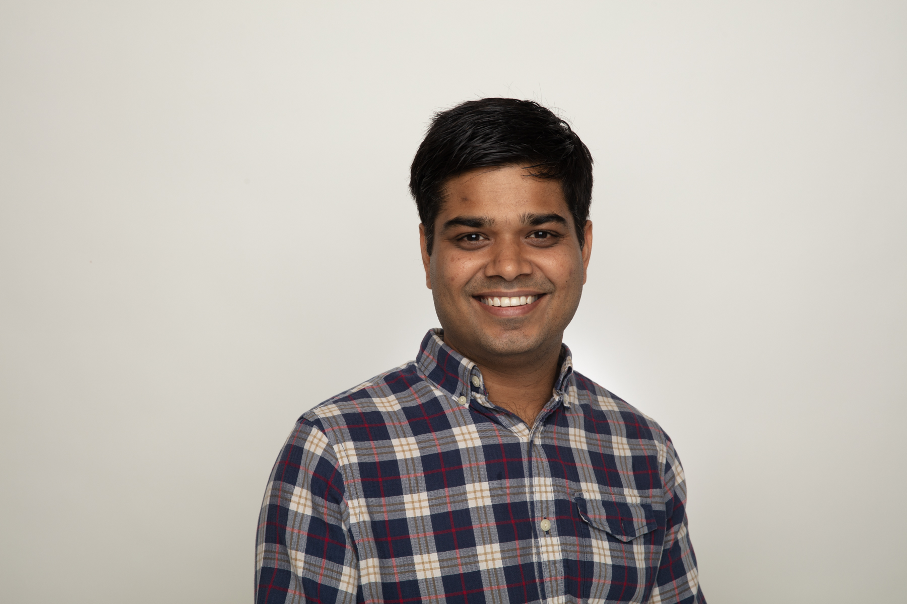

  

## 2022 Program

| | |
|:--- |---:|
| Opening Remarks | 13.00 - 13.15 (15 mins) |
|:--- |---:|
| Invited talk: Ashok N. Srivastava, Intuit, Senior VP and Chief Data Officer | 13.15 - 13.45 (30 mins) |
|:---|---:|
| Invited talk: Shiv Vitaladevuni, Director of Alexa AI Research  | 13.45 - 14.15 (30 mins) |
|:---|---:|
| Coffee Break and registration for round tables| 14.15 - 14.30 (15 mins) |
|:---|---:|
| [Machine Learning Research Phase Tracking with Hypotheses Graphs](papers/wamlm-kdd22_paper_269.pdf) (Yongzhi Ong and Vincent Pollet) | 14.30 - 14.45 (15 mins) |
|:---|---:|
| [An Innovation Funnel for Machine Learning Projects](papers/wamlm-kdd22_paper_3529.pdf) (Vatche Isahagian, Yara Rizk, Vinod Muthusamy, Merve Unuvar and Ayhan Sebi) | 14.45 - 15.00 (15 mins) |
|:---|---:|
| [Effective ML asset management using AIML Service Kits and achieving organizational excellence](papers/wamlm-kdd22_paper_4651.pdf) (Ashish Kumar Balla and Nitin Aggarwal) | 15.00 - 15.15 (15 mins) |
|:---|---:|
| Coffee Break | 15.15 - 15.30 (15 mins) |
|:---|---:|
|Round-table discussions | 15.30 - 16.15 (45 mins) |
|:---|---:|
| [Stakeholder and Team Management in Data Science: Principles and Practical Tips](papers/wamlm-kdd22_paper_5361.pdf) (Hrishikesh Vidyadhar Ganu and Mohak Sukhwani) | 16.15 - 16.30 (15 mins) |
|:---|---:|
| [Comparing Model Development Practices in B2B vs B2C Machine Learning Teams](papers/wamlm-kdd22_paper_6998.pdf) (Saloni Potdar and Navneet Rao) | 16.30 - 16.45 (15 mins) |
|:---|---:|
| Closing Remarks | 16.45 - 16.50 (5 mins) |

## Invited speakers

#### Shiv Vitaladevuni, Amazon, Director of Alexa AI Research in Perceptual Technologies.

Shiv Vitaladevuni is a Director in Applied Sciences at Amazon Alexa, leading one of the speech and ML organizations. His organization’s mission is to make Alexa more perceptive and contextually aware so that Alexa is better able to determine when and how to help customers. They develop technologies such as wakeword, acoustic event detection, speaker understanding and paralinguistics, used by millions of customers across the globe. Consisting of 150+ scientists and engineers, the team brings together expertise in speech and ML science and engineering, embedded and cloud services, deep learning, signal processing, large scale data analytics. The team emphasizes close collaboration between science and engineering, executing on high risk R&D efforts to deliver state-of-the-art ML products to our customers, and technical excellence to build high availability ML systems and services.

#### Ashok N. Srivastava, Intuit, Senior Vice President and Chief Data Officer.

Ashok N. Srivastava, Ph.D. is the Senior Vice President and Chief Data Officer at Intuit. He is responsible for setting the vision and direction for AI and Data across Intuit to power prosperity across the world. He is an Adjunct Professor at Stanford and a member of the Board of Directors of the University of Colorado Foundation.  He serves on a committee for the National Academy of Science, Engineering, and Medicine on a Congressionally mandated study on  Emerging Trends in Aviation Safety.  Ashok is a Fellow of the IEEE, the American Association for the Advancement of Science (AAAS), and the American Institute of Aeronautics and Astronautics (AIAA).

Previously, he was the VP of Big Data and Artificial Intelligence Systems and the Chief Data Scientist at Verizon.  His global team focused on building new revenue-generating products and services powered by big data and artificial intelligence.  He is the founder and former Editor-in-Chief of the AIAA Journal of Aerospace Information Systems.

At NASA, he led advanced technology programs in Aerospace, Space Systems, and Earth and Space Sciences including the System-wide Safety and Assurance Technology and the Integrated Vehicle Health Management programs.  He served as a Venture Advisor focusing on big-data analytics at Trident Capital, and was on the advisory board of several startups.

Ashok is the author of over 100 research articles in data mining, machine learning, and text mining, and has edited four books in these subjects:  Text Mining: Classification, Clustering, and Applications, Advances in Machine Learning and Data Mining for Astronomy,  Machine Learning for Engineering Systems Health Management, and Large-Scale Machine Learning in the Earth Sciences.

He has over 30 patents awarded and several under file. He has won numerous awards including the IEEE Computer Society Technical Achievement Award for “pioneering contributions to intelligent information systems,” the NASA Exceptional Achievement Medal for contributions to state-of-the-art data mining and analysis, the NASA Honor Award for Outstanding Leadership, the NASA Distinguished Performance Award, several NASA Group Achievement Awards, the Distinguished Engineering Alumni Award from UC Boulder, the IBM Golden Circle Award, and the Department of Education Merit Fellowship.

#### Round-table discussions

- How to successfully introduce ML to new orgs. *Presenters: Mingwei Shen, Ofri Mann and Aner Hamama*
- Building new ML teams. *Presenters: Lory Nunez*
- Industry vs research. *Presenters: Sarah Campbell*
- Scrum in ML. *Presenters: Ashish Bansal, Mark Ally and Vijay Morampudi*
- ML main pitfals/challenges. *Presenters: Muna Abdelrahim, Tor Kwembe and Polina Reshetova*
- ML for business optimization. *Presenters: Gerben Oostra, Hanan Shteingart*

# Organizers

| | |
|:--- |:---|
| | **Dmitri (Dima) Goldenberg**  is a Senior Machine Learning Manager at Booking.com, Tel Aviv, where he leads machine learning efforts in recommendations, pricing and promotions personalization, utilizing online learning and uplift modeling techniques. Goldenberg obtained his Masters in Industrial Engineering and Management (with honors) from Tel Aviv University. He led the WSDM '21 and WWW '21 tutorials on personalization and causal uplift modeling, and co-organized the WSDM '21 WebTour, KDD'22 WAMLM and Recsys'22 RecTour workshops. His research and applied work was presented and published in top journals and conferences including WWW, CIKM, WSDM, SIGIR, KDD and RecSys. |
| | |
|  | **Elena Sokolova** is a Science Manager in applied machine learning in Amazon Research, Cambridge UK. Elena did her PhD in Nijmegen University in the Netherlands, where she worked on Recommender systems and Causality. She is now leading several projects and  teams in Alexa AI in NLP and TTS. Under her lead her team published papers in various conferences such as EMNLP, ICASSP, Interspeech, and filed several patents. Elena was nominated for European Women in Tech lead in Data award in 2019.|
| | |
|  | **Shir Meir Lador** is a Data Science group manager at Intuit, a global leader in the industry of financial management software. Shir is the co-founder of PyData Tel Aviv meetups, WiDS Tel Aviv ambassador, the co-host of “Unsupervised” (a podcast discussing data science in Israel), and gives talks at various machine learning and data science conferences and meetups. Shir holds an M.Sc. in electrical engineering and computers with a major in machine learning and signal processing from Ben-Gurion University.|
| | |
|  |**Amit Mandelbaum** is the founder and CTO of Everminds, a Generative AI startup aimed for changing how people communicate and share knowledge. Prior to that, amit served as a Director of AI at Nvidia and as the leading data scientist at Imubit. Amit is also the founder and co-leader of JerusML, Jerusalem’s AI and largest tech community. Amit published papers in several conferences, including AAAI, GECCO, IntelliSys, ISPA and more. Amit holds an M.Sc. (with honors) in Computer Science from the Hebrew University. |
| | |
|   | **Irina Vasilinetc** is a Senior Manager in Meta. Irina supports WhatsApp Integrity team in London UK. Irina has several publications in statistics and bioinformatics. |
| | |
|   | **Ankit Jain** is a Research Science Manager at Meta. He leads a team of ML scientists/engineers to detect harmful actors on Meta platforms using advanced deep learning techniques. Previously, he was a ML researcher at Uber AI where he worked on application of deep learning methods to different problems ranging from food delivery, fraud detection to self-driving cars. He was named as one of top 40under40 Data Scientists 2022 by Analytics India Magazine. He has co-authored a best selling book on machine learning titled TensorFlow Machine Learning Projects. Additionally, he’s been a featured speaker in many of the top AI conferences and universities and has published papers in several top conferences like Neurips, ICLR. |
| 
 |

