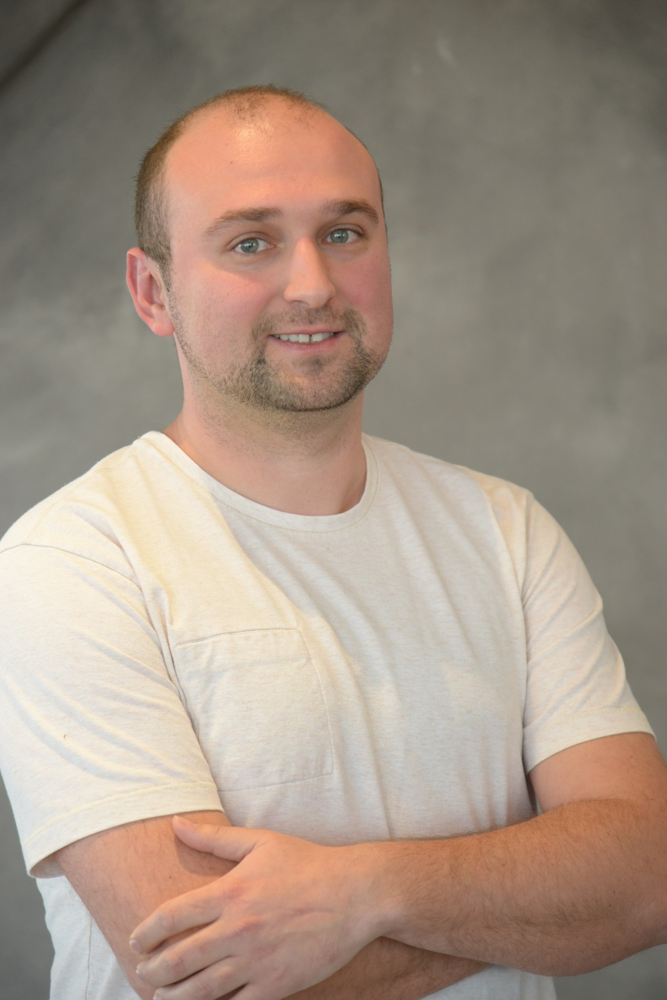
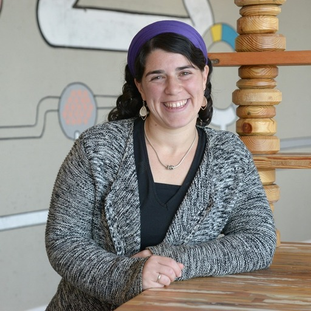

## Overview

Machine learning applications are rapidly adopted by industry leaders in any field. The growth of investment in AI-driven solutions created new challenges in managing Data Science and ML resources, people and projects as a whole. The discipline of managing applied machine learning teams, requires a healthy mix between agile product development tool-set and a long term research oriented mindset.  The abilities of investing in deep research while at the same time connecting the outcomes to significant business results create a large knowledge based on management methods and best practices in the field. The Workshop on Applied Machine Learning Management brings together applied research managers from various fields to share methodologies and case-studies on management of ML teams, products, and projects, achieving business impact with advanced AI-methods.

## Important Dates

| | |
|:--- |---:|
| <a href="https://easychair.org/conferences/?conf=wamlmkdd23"> Paper submission </a> deadline | June 6th, 2023 |
|:---|---:|
| Notification of acceptance | June 30th, 2023 |
|:---|---:|
| Workshop on Applied Machine Learning Management| August 7th 2023, 8am-12pm |

## How to attend

The workshop is a part of the ACM SIGKDD CONFERENCE ON KNOWLEDGE DISCOVERY AND DATA MINING that will happen in Long Beach Convention & Entertainment center 6-10 August, 2023, more information can be found on the official site of the conference: https://kdd.org/kdd2023/. In order to attend the workshop you need to register to the main conference. Registration will open soon. You don't need to submit a paper if you want to attend. The conference will be in person.

## 2023 Program

| | |
|:--- |:---|
| `8.00-8.15`   (15 mins)| Opening Remarks |
|:--- |:---|
| `8.15-8.45`   (30 mins) | Invited talk: Nhung Ho, Intuit, Vice President of Artificial Intelligence |
|:--- |:---|
| `8.45-9.15`  (30 mins) | Invited talk: CJ Taylor, Amazon, Director of Applied Science (AWS Rekognition, Textract) |
|:--- |:---|
| `9.15-9.30`  (15 mins) | [Exploring the Trade-Off: Centralized vs Embedded Models for ML Scientists](papers/wamlm-kdd23_paper_matteo_ruffini.pdf)  (Matteo Ruffini and Joos-Hendrik Boese) |
|:--- |:---|
| `9.30-10.00`  (30 mins) | Coffee Break and registration for round tables |
|:--- |:---|
| `10.00-10.15`  (15 mins) | [The Art of Building ML as a Product: Key Learnings and Strategies](papers/wamlm-kdd23_paper_Shashank_Shashikant_Rao.pdf) (Shashank Shashikant Rao) |
|:--- |:---|
| `10.15 - 10.30`   (15 mins) | [Onebrain — microprojects for data science](papers/wamlm-kdd23_paper_Daniel_Miller.pdf)   (Daniel Miller, Alex Deng, Narek Amirbekian, Navin Sivanandam and Rodolfo Carboni) |
|:--- |:---|
|`10.30-11.15`  (45 mins) | Round-table discussions |
|:--- |:---|
| `11.15-11.30`   (15 mins) | [Achieving ML Reliability at Scale - Learnings and Opportunities](papers/wamlm-kdd23_paper_Ritu_Singh.pdf) (Ritu Singh and Namit Gupta) |
|:--- |:---|
| `11.30-11.45`   (15 mins) | [Building and Leading a Team for Generative AI Product](papers/wamlm-kdd23_paper_moran_beladev.pdf) (Moran Beladev) |
|:--- |:---|
| `11.45-11.50`   (5 mins) | Closing Remarks |

## Invited speakers

#### Nhung Ho, Intuit, Vice President of Artificial Intelligence.

Nhung is Vice President of Artificial Intelligence for Intuit’s QuickBooks Ecosystem, TurboTax, and Customer Success organizations. She leads applied science teams that build new-to-the-world products and services backed by artificial intelligence to serve the company’s small business and consumer customers. They solve a variety of problems, ranging from call center demand forecasting and natural language systems to identifying customer intent, automating accounting, and making tax automatic. During her time at Intuit, she has been part of evolving artificial intelligence from a niche field that solved narrow problems to one that is at the core of Intuit’s strategy to become the AI-driven expert platform. Nhung has a Ph.D. in Astrophysics from Yale University and a B.A. in Astrophysics from University of California, Berkeley.

#### CJ Taylor, Amazon, Director of Applied Science (AWS Rekognition, Textract).

CJ Taylor is a Director in Applied Sciences at Amazon’s AWS AI Labs, where he leads one of the largest Computer Vision science teams at Amazon. AI Labs-CV is responsible for the science behind AWS Rekognition, Textract and the planned CV features behind Bedrock, AWS’s Generative AI offering. Over his 11 year tenure at Amazon, CJ also served in the retail business as Applied Science Director for the Visual Search team where they developed visual search for product recognition and augmented reality for product visualization - both available in the mobile app. Prior to Amazon, he spent 14 years in various startups working on video analytics, industrial inspection and SBIR-funded CV research spanning brain MRIs analysis to UAV systems. In the distant past, he served as an ECE lecturer and Robotics Institute researcher at CMU as well as a couple years teaching high school physics. CJ has an M.S. in ECE from CMU and a S.B. in physics from MIT.

## Round-table discussions

- [Incorporating Advances in LLMs into the Machine Learning Lifecycle](papers/wamlm-kdd23_paper_Navneet_Rao.pdf). *Presenters: Navneet Rao*
- [Unlocking Value with LLMs: A Roadmap from Concept to Production](papers/wamlm-kdd23_paper_Tal_Peretz.pdf). *Presenters: Tal Peretz*
- [Perspectives on recurring challenges faced by ML product teams](papers/wamlm-kdd23_paper_Likhitha_Patha.pdf). *Presenters: Likhitha Patha and Nisarga Markandaiah*
- [The Science and Art of Driving Business Adoption of ML Models](papers/wamlm-kdd23_paper_Hrishikesh_Vidyadhar.pdf). *Presenters: Hrishikesh Vidyadhar Ganu and Mohak Sukhwani*
- [Effective Management of Data Sources in Machine Learning](papers/wamlm-kdd23_paper_Kristina_Fedorenko.pdf.pdf). *Presenters: Kristina Fedorenko*

## Organizers

| | |
|:--- |:---|
| | **Dmitri (Dima) Goldenberg**  is a Senior Machine Learning Manager at Booking.com, Tel Aviv, where he leads machine learning efforts in recommendations, pricing and promotions personalization, utilizing online learning and uplift modeling techniques. Goldenberg obtained his Masters in Industrial Engineering and Management (with honors) from Tel Aviv University. He led the WSDM '21 and WWW '21 tutorials on personalization and causal uplift modeling, and co-organized the WSDM '21 WebTour, KDD'22 WAMLM and Recsys'22 RecTour workshops. His research and applied work was presented and published in top journals and conferences including WWW, CIKM, WSDM, SIGIR, KDD and RecSys. |
| | |
|  | **Elena Sokolova** is a Science Manager in applied machine learning in Amazon Research, Cambridge UK. Elena did her PhD in Nijmegen University in the Netherlands, where she worked on Recommender systems and Causality. She is now leading several projects and  teams in Alexa AI in NLP and TTS. Under her lead her team published papers in various conferences such as EMNLP, ICASSP, Interspeech, and filed several patents. Elena was nominated for European Women in Tech lead in Data award in 2019.|
| | |
|  | **Shir Meir Lador** is a Data Science group manager at Intuit, a global leader in the industry of financial management software. Shir is the co-founder of PyData Tel Aviv meetups, WiDS Tel Aviv ambassador, the co-host of “Unsupervised” (a podcast discussing data science in Israel), and gives talks at various machine learning and data science conferences and meetups. Shir holds an M.Sc. in electrical engineering and computers with a major in machine learning and signal processing from Ben-Gurion University.|
| | |
|  |**Amit Mandelbaum** is the founder and CTO of Everminds, a Generative AI startup aimed for changing how people communicate and share knowledge. Prior to that, amit served as a Director of AI at Nvidia and as the leading data scientist at Imubit. Amit is also the founder and co-leader of JerusML, Jerusalem’s AI and largest tech community. Amit published papers in several conferences, including AAAI, GECCO, IntelliSys, ISPA and more. Amit holds an M.Sc. (with honors) in Computer Science from the Hebrew University. |
| | |
|   | **Irina Vasilinetc** is a Senior Manager in Meta. Irina supports WhatsApp Integrity team in London UK. Irina has several publications in statistics and bioinformatics. |
| | |
|   | **Ankit Jain** is a Research Science Manager at Meta. He leads a team of ML scientists/engineers to detect harmful actors on Meta platforms using advanced deep learning techniques. Previously, he was a ML researcher at Uber AI where he worked on application of deep learning methods to different problems ranging from food delivery, fraud detection to self-driving cars. He was named as one of top 40under40 Data Scientists 2022 by Analytics India Magazine. He has co-authored a best selling book on machine learning titled TensorFlow Machine Learning Projects. Additionally, he’s been a featured speaker in many of the top AI conferences and universities and has published papers in several top conferences like Neurips, ICLR. |
| | |
|   |**Amit Weil Modlinger** is a data science leader with extensive experience in the technology industry. She is currently a Senior Manager at Drata, a top-rated security and compliance automation platform. Previously, Amit served as the Head of Data Science at Simplex, acquired by Nuvei. Amit is the founder of the Israeli community for Data Science Leads and a community leader at the Technology Team Managers Forum as part of Baot community, Israel's largest community of experienced women in software engineering and data science. |
| | |
|   |**Lin Lee Cheong** is an Applied Science Manager with Machine Learning Solutions Lab (MLSL) in AWS at Santa Clara, CA. Lin Lee received her PhD in Electrical Engineering from the Massachusetts Institute of Technology at Cambridge, MA. She leads a team of scientists and engineers and collaborate directly with AWS strategic customers to develop practical and innovative machine learning solutions. Under her lead, the team has presented and published papers in various conferences such as KDD, NeurIPS and ICCV and filed multiple patents. Previously, she focused on applying machine learning and statistical methods to the semiconductor industry.  |
| | |
|   |**Panpan Xu** is a Senior Applied Scientist and Manager with Machine Learning Solutions Lab (MLSL) in AWS at Santa Clara, CA. Panpan did her PhD in Computer Science in Hong Kong University of Science and Technology. She leads a team of scientists to deliver innovative and practical ML solutions for strategic AWS customers. She is broadly interested in multidisciplinary research that combines ML, data visualization, and human-computer interaction to help people better understand large and complex data, develop ML models to address real-world use cases, and distill and communicate their findings in an intuitive manner. She publishes at conferences including SIGKDD, SIGCHI and IEEE VIS and received Best Paper award/Best Paper Honorable Mention award at IEEE VIS. |
| | |
|   | **Chana Ross** is a Machine Learning Manager at Booking.com in Tel Aviv. Her team is known for developing a centralized platform which serves complex machine learning solutions for Recommender Systems including modeling approaches like Contextual Bandits, and Reinforcement Learning. The team includes scientists and developers which help teams across Booking provide personalized and relevant recommendations to customers. Ross holds a Masters degree in Applied Mathematics from Technion University in Haifa. Prior to Booking.com, she was at Bosch in the automotive industry, where she tackled decision-making problems using Reinforcement Learning. She is driven by the challenge of using advanced machine learning techniques, combined with proven methods, to solve real-world problems in a way that's both effective and understandable. Ross has shared her work and insights at major conferences and in journals, including RecSys, IEEE RAL, IEEE ICRA, ICAPS.  |
| | |
|   | **Saloni Potdar** is a Senior AI/ML Manager in Apple’s Siri and Information Intelligence team. She leads the development of natural language processing and machine learning techniques that power interactions across Siri and Spotlight Search. She works on LLMs, knowledge graphs, question answering, entity linking and synthetic data generation, and deploying these algorithms at scale. Prior to this, she was a Senior Technical Staff Member and Senior Manager at IBM Watson where she developed algorithms for IBM's conversational AI product - Watson Assistant. She has won several awards and was also a semi-finalist on MIT’s TR 35 under 35 in 2022. She was recognized as a Master Inventor at IBM for filing over 30 patents and pushing the boundaries of patent excellence. She has published over 15 research papers at top conferences like AAAI, NAACL, EMNLP and ACL. She got her Masters degree from Language Technologies Institute at Carnegie Mellon University in 2014.
 |

