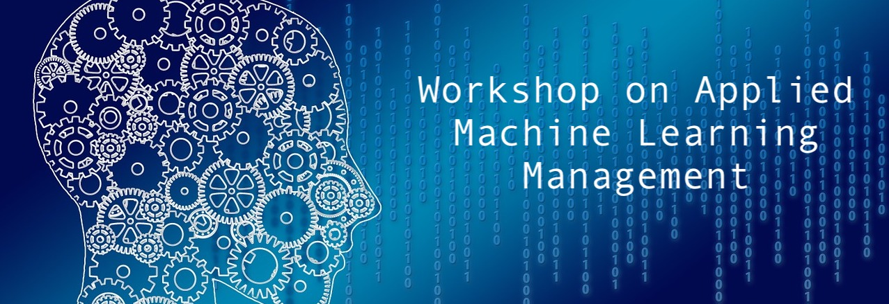
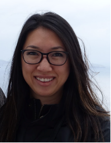

## Overview

Machine learning applications are rapidly adopted by industry leaders in any field. The growth of investment in AI-driven solutions created new challenges in managing Data Science and ML resources, people and projects as a whole. The discipline of managing applied machine learning teams, requires a healthy mix between agile product development tool-set and a long term research oriented mindset.  The abilities of investing in deep research while at the same time connecting the outcomes to significant business results create a large knowledge based on management methods and best practices in the field. The Workshop on Applied Machine Learning Management brings together applied research managers from various fields to share methodologies and case-studies on management of ML teams, products, and projects, achieving business impact with advanced AI-methods.

## Important Dates

| | |
|:--- |---:|
| <a href="https://easychair.org/conferences/?conf=wamlmkdd23"> Paper submission </a> deadline | June 6th, 2023 |
|:---|---:|
| Notification of acceptance | June 30th, 2023 |
|:---|---:|
| Workshop on Applied Machine Learning Management| August 7th 2023, 8am-12pm |

## How to attend

The workshop is a part of the ACM SIGKDD CONFERENCE ON KNOWLEDGE DISCOVERY AND DATA MINING that will happen in Long Beach Convention & Entertainment center 6-10 August, 2023, more information can be found on the official site of the conference: https://kdd.org/kdd2023/. In order to attend the workshop you need to register to the main conference. Registration will open soon. You don't need to submit a paper if you want to attend. The conference will be in person.

## 2023 Program

| | |
|:--- |:---|
| `8.00-8.15`   (15 mins)| Opening Remarks |
|:--- |:---|
| `8.15-8.45`   (30 mins) | Invited talk: Nhung Ho, Intuit, Vice President of Artificial Intelligence |
|:--- |:---|
| `8.45-9.15`  (30 mins) | Invited talk: CJ Taylor, Amazon, Director of Applied Science (AWS Rekognition, Textract) |
|:--- |:---|
| `9.15-9.30`  (15 mins) | Coffee Break and registration for round tables |
|:--- |:---|
| `9.30-9.45`  (15 mins) | [Exploring the Trade-Off: Centralized vs Embedded Models for ML Scientists](papers/wamlm-kdd23_paper_matteo_ruffini.pdf)  (Matteo Ruffini and Joos-Hendrik Boese) |
|:--- |:---|
| `9.45-10.00`  (15 mins) | [The Art of Building ML as a Product: Key Learnings and Strategies](papers/wamlm-kdd23_paper_Shashank_Shashikant_Rao.pdf) (Shashank Shashikant Rao) |
|:--- |:---|
| `10.00 - 10.15`   (15 mins) | [Onebrain — microprojects for data science](papers/wamlm-kdd23_paper_Daniel_Miller.pdf)   (Daniel Miller, Alex Deng, Narek Amirbekian, Navin Sivanandam and Rodolfo Carboni) |
|:--- |:---|
| `10.15-10.30`  (15 mins) | Coffee Break |
|:--- |:---|
|`10.30-11.15`  (45 mins) | Round-table discussions |
|:--- |:---|
| `11.15-11.30`   (15 mins) | [Achieving ML Reliability at Scale - Learnings and Opportunities](papers/wamlm-kdd23_paper_Ritu_Singh.pdf) (Ritu Singh and Namit Gupta) |
|:--- |:---|
| `11.30-11.45`   (15 mins) | [Building and Leading a Team for Generative AI Product](papers/wamlm-kdd23_paper_moran_beladev.pdf) (Moran Beladev) |
|:--- |:---|
| `11.45-11.50`   (5 mins) | Closing Remarks |

## Invited speakers

#### Nhung Ho, Intuit, Vice President of Artificial Intelligence.

Nhung is Vice President of Artificial Intelligence for Intuit’s QuickBooks Ecosystem, TurboTax, and Customer Success organizations. She leads applied science teams that build new-to-the-world products and services backed by artificial intelligence to serve the company’s small business and consumer customers. They solve a variety of problems, ranging from call center demand forecasting and natural language systems to identifying customer intent, automating accounting, and making tax automatic. During her time at Intuit, she has been part of evolving artificial intelligence from a niche field that solved narrow problems to one that is at the core of Intuit’s strategy to become the AI-driven expert platform. Nhung has a Ph.D. in Astrophysics from Yale University and a B.A. in Astrophysics from University of California, Berkeley.

#### CJ Taylor, Amazon, Director of Applied Science (AWS Rekognition, Textract).

CJ Taylor is a Director in Applied Sciences at Amazon’s AWS AI Labs, where he leads one of the largest Computer Vision science teams at Amazon. AI Labs-CV is responsible for the science behind AWS Rekognition, Textract and the planned CV features behind Bedrock, AWS’s Generative AI offering. Over his 11 year tenure at Amazon, CJ also served in the retail business as Applied Science Director for the Visual Search team where they developed visual search for product recognition and augmented reality for product visualization - both available in the mobile app. Prior to Amazon, he spent 14 years in various startups working on video analytics, industrial inspection and SBIR-funded CV research spanning brain MRIs analysis to UAV systems. In the distant past, he served as an ECE lecturer and Robotics Institute researcher at CMU as well as a couple years teaching high school physics. CJ has an M.S. in ECE from CMU and a S.B. in physics from MIT.

## Round-table discussions

- [Incorporating Advances in LLMs into the Machine Learning Lifecycle](papers/wamlm-kdd23_paper_Navneet_Rao.pdf). *Presenters: Navneet Rao*
- [Unlocking Value with LLMs: A Roadmap from Concept to Production](papers/wamlm-kdd23_paper_Tal_Peretz.pdf). *Presenters: Tal Peretz*
- [Perspectives on recurring challenges faced by ML product teams](papers/wamlm-kdd23_paper_Likhitha_Patha.pdf). *Presenters: Likhitha Patha and Nisarga Markandaiah*
- [The Science and Art of Driving Business Adoption of ML Models](papers/wamlm-kdd23_paper_Hrishikesh_Vidyadhar.pdf). *Presenters: Hrishikesh Vidyadhar Ganu and Mohak Sukhwani*
- [Best Practices for Testing and Validating Machine Learning](papers/wamlm-kdd23_paper_Philip_Tannor.pdf). *Presenters: Philip Tannor*
- [Effective Management of Data Sources in Machine Learning](papers/wamlm-kdd23_paper_Kristina_Fedorenko.pdf). *Presenters: Kristina Fedorenko*

