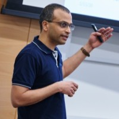

  

## Overview

Machine learning applications are rapidly adopted by industry leaders in any field. The growth of investment in AI-driven solutions created new challenges in managing Data Science and ML resources, people and projects as a whole. The discipline of managing applied machine learning teams, requires a healthy mix between agile product development tool-set and a long term research oriented mindset.  The abilities of investing in deep research while at the same time connecting the outcomes to significant business results create a large knowledge based on management methods and best practices in the field. The Workshop on Applied Machine Learning Management brings together applied research managers from various fields to share methodologies and case-studies on management of ML teams, products, and projects, achieving business impact with advanced AI-methods.

## Important Dates

| | |
|:--- |---:|
| Paper submission deadline | **May 26, 2022** |
|:---|---:|
| Notification of acceptance | June 20, 2022 |
|:---|---:|
| Workshop on Applied Machine Learning Management    | 13.00 - 17.00 August 15, 2022 |

## How to attend

The workshop is a part of the ACM SIGKDD CONFERENCE ON KNOWLEDGE DISCOVERY AND DATA MINING that will happen in Washington DC Convention Center August 14-18, 2022, more information can be found on the official site of the conference: https://kdd.org/kdd2022/. In order to attend the workshop you need to register to the main conference. Registration will open soon. You don't need to submit a paper if you want to attend. The conference will be in person.

## Call for talk proposals

The workshop focuses on main aspects of a successful ML resource management: project lifecycle, people management and ML quality and excellence. We focus on a combination of soft skills applications along with data-driven and empirical approaches to efficiently resolve ML management challenges.

The ML projects life-cycle management include research resources allocation and collaboration with product development, to achieve innovative and applicable outcomes. We solicit presenting real case-studies and high level working model proposals. At the same time, the people management aspects include the unique properties of ML talents and the specific challenges in building AI organisations, fostering research culture and growing research driven individuals in a business driven environment.  Finally, the ML excellence topic include aspects of high-quality ML models and working processes, together with tooling and best practices to ensure them.

We solicit **talk proposals** for the plenary talks session. The proposals should be 0.25-1 page. We also invite **panel round-table** discussion proposals. Please include in the submission:

- Description of the talk/panel discussion:
  - Title
  - Abstract of the talk proposal or round table proposal
  - Potential discussion points
  - An explanation about relevance of this talk/panel discussion to the workshop
- Infor about the presenter:
  - A short bio of the main presenter (~100 words)
  - A brief company or project portrait (~60 words)
- Optional:
  - References to any existing public materials by the authors on the discussed topic

Proposals should be submitted electronically by May 26th via [Easychair](https://easychair.org/my/conference?conf=wamlmkdd22):

[https://easychair.org/my/conference?conf=wamlmkdd22](https://easychair.org/my/conference?conf=wamlmkdd22)

## Topics of Interest

 The key target audience for this workshop are ML leaders, in different industries and academia, ranging from small teams to department and company leaders. Moreover, the workshop can provide unique insights to any ML practitioner about the processes of managing applied research and share knowledge and ideas between different organisations. While hosted at an academic venue, the applied nature of the workshop allows to apply data-driven approaches on the art of machine learning management.

- **Managing Machine Learning Projects**
  - ML Projects life-cycle management
  - Research management
  - Collaboration with product development
  - Integration of ML solution in organization
  - Agile Data Science
  - Case studies and evaluation
  - Presenting ML solutions
- **People Management in ML**
  - Hiring and building ML teams
  - ML talent development
  - Building mission based teams
  - Culture of applied ML
  - Community building
  - Stakeholder management in ML
  - Measuring success in DS team
- **ML Excellence**
  - Maintaining quality in ML
  - System and infrastructure management
  - Best practices in ML workflow
  - Knowledge management
  - ML assets management
- **ML as a product**
  - How to make a successful product from ML tech
  - Challenges of measuring value of ML
  - Stages of ML product development

## Invited speakers

#### Shiv Vitaladevuni, Amazon, Director of Alexa AI Research in Perceptual Technologies.

Shiv Vitaladevuni is a Director in Applied Sciences at Amazon Alexa, leading one of the speech and ML organizations. His organization’s mission is to make Alexa more perceptive and contextually aware so that Alexa is better able to determine when and how to help customers. They develop technologies such as wakeword, acoustic event detection, speaker understanding and paralinguistics, used by millions of customers across the globe. Consisting of 150+ scientists and engineers, the team brings together expertise in speech and ML science and engineering, embedded and cloud services, deep learning, signal processing, large scale data analytics. The team emphasizes close collaboration between science and engineering, executing on high risk R&D efforts to deliver state-of-the-art ML products to our customers, and technical excellence to build high availability ML systems and services.

#### Ashok N. Srivastava, Intuit, Senior Vice President and Chief Data Officer.

Ashok N. Srivastava, Ph.D. is the Senior Vice President and Chief Data Officer at Intuit. He is responsible for setting the vision and direction for AI and Data across Intuit to power prosperity across the world. He is an Adjunct Professor at Stanford and a member of the Board of Directors of the University of Colorado Foundation.  He serves on a committee for the National Academy of Science, Engineering, and Medicine on a Congressionally mandated study on  Emerging Trends in Aviation Safety.  Ashok is a Fellow of the IEEE, the American Association for the Advancement of Science (AAAS), and the American Institute of Aeronautics and Astronautics (AIAA).

Previously, he was the VP of Big Data and Artificial Intelligence Systems and the Chief Data Scientist at Verizon.  His global team focused on building new revenue-generating products and services powered by big data and artificial intelligence.  He is the founder and former Editor-in-Chief of the AIAA Journal of Aerospace Information Systems.

At NASA, he led advanced technology programs in Aerospace, Space Systems, and Earth and Space Sciences including the System-wide Safety and Assurance Technology and the Integrated Vehicle Health Management programs.  He served as a Venture Advisor focusing on big-data analytics at Trident Capital, and was on the advisory board of several startups.

Ashok is the author of over 100 research articles in data mining, machine learning, and text mining, and has edited four books in these subjects:  Text Mining: Classification, Clustering, and Applications, Advances in Machine Learning and Data Mining for Astronomy,  Machine Learning for Engineering Systems Health Management, and Large-Scale Machine Learning in the Earth Sciences.

He has over 30 patents awarded and several under file. He has won numerous awards including the IEEE Computer Society Technical Achievement Award for “pioneering contributions to intelligent information systems,” the NASA Exceptional Achievement Medal for contributions to state-of-the-art data mining and analysis, the NASA Honor Award for Outstanding Leadership, the NASA Distinguished Performance Award, several NASA Group Achievement Awards, the Distinguished Engineering Alumni Award from UC Boulder, the IBM Golden Circle Award, and the Department of Education Merit Fellowship.

## Tentative Program

| | |
|:--- |---:|
| Opening Remarks | 13.00 - 13.15 (15 mins) |
|:--- |---:|
| Invited talk: Shiv Vitaladevuni, Director of Alexa AI Research  | 13.15 - 13.45 (30 mins) |
|:---|---:|
| Invited talk: Ashok N. Srivastava, Intuit, Senior VP and Chief Data Officer | 13.45 - 14.15 (30 mins) |
|:---|---:|
| Coffee Break and registration for round tables| 14.15 - 14.30 (15 mins) |
|:---|---:|
| Machine Learning Research Phase Tracking with Hypotheses Graphs (Yongzhi Ong and Vincent Pollet) | 14.30 - 14.45 (15 mins) |
|:---|---:|
| An Innovation Funnel for Machine Learning Projects (Vatche Isahagian, Yara Rizk, Vinod Muthusamy, Merve Unuvar and Ayhan Sebi) | 14.45 - 15.00 (15 mins) |
|:---|---:|
| Effective ML asset management using AIML Service Kits and achieving organizational excellence (Ashish Kumar Balla and Nitin Aggarwal) | 15.00 - 15.15 (15 mins) |
|:---|---:|
| Coffee Break | 15.15 - 15.30 (15 mins) |
|:---|---:|
|Round-table discussions | 15.30 - 16.15 (45 mins) |
|:---|---:|
| Stakeholder and Team Management in Data Science: Principles and Practical Tips (Hrishikesh Vidyadhar Ganu and Mohak Sukhwani) | 16.15 - 16.30 (15 mins) |
|:---|---:|
| Comparing Model Development Practices in B2B vs B2C Machine Learning Teams (Saloni Potdar and Navneet Rao) | 16.30 - 16.45 (15 mins) |
|:---|---:|
| Closing Remarks | 16.45 - 16.50 (5 mins) |

#### Round-table discussions

- How to successfully introduce ML to new orgs. *Presenters: Mingwei Shen and Ofri Mann*
- Building new ML teams. *Presenters: Lory Nunez*
- Industry vs research. *Presenters: Sarah Campbell*
- Scrum in ML. *Presenters: Ashish Bansal and Vijay Morampudi*
- ML main pitfals/challenges. *Presenters: Muna Abdelrahim and Polina Reshetova*
- ML for business optimization. *Presenters: Gerben Oostra*

