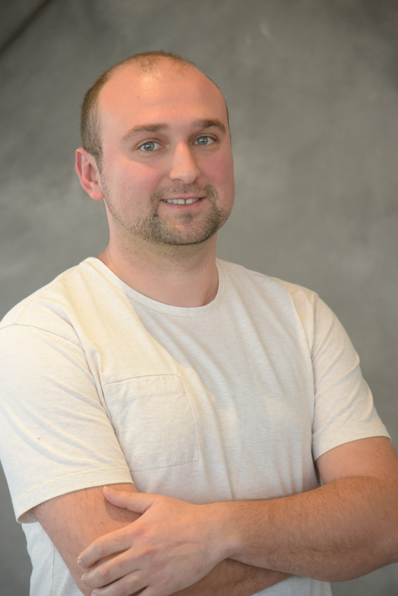
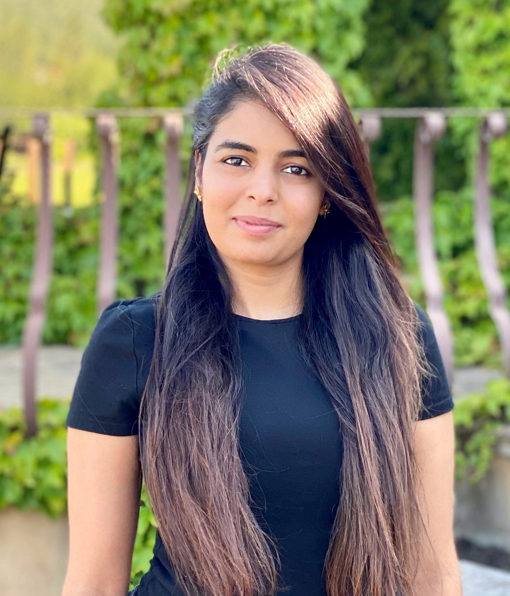

<meta property="og:image" content="images/background.jpeg"/>

## Overview

Machine learning applications are rapidly adopted by industry leaders in any field. The growth of investment in AI-driven solutions created new challenges in managing Data Science and ML resources, people and projects as a whole. The discipline of managing applied machine learning teams, requires a healthy mix between agile product development tool-set and a long term research oriented mindset.  The abilities of investing in deep research while at the same time connecting the outcomes to significant business results create a large knowledge based on management methods and best practices in the field. The Workshop on Applied Machine Learning Management brings together applied research managers from various fields to share methodologies and case-studies on management of ML teams, products, and projects, achieving business impact with advanced AI-methods.

## Important Dates

| | |
|:--- |---:|
| <a href="https://easychair.org/my/conference?conf=wamlmkdd24"> Paper submission deadline </a> | June 9th, 2024 |
|:---|---:|
| Notification of acceptance | July 9th, 2024 |
|:---|---:|
| Workshop on Applied Machine Learning Management| August 26th 2024, 8am-12pm |

## Call for talk proposals

The workshop focuses on main aspects of a successful ML resource management: project lifecycle, people management and ML quality and excellence. We focus on a combination of soft skills applications along with data-driven and empirical approaches to efficiently resolve ML management challenges.

The ML projects life-cycle management include research resources allocation and collaboration with product development, to achieve innovative and applicable outcomes. We solicit presenting real case-studies and high level working model proposals. At the same time, the people management aspects include the unique properties of ML talents and the specific challenges in building AI organisations, fostering research culture and growing research driven individuals in a business driven environment.  Finally, the ML excellence topic include aspects of high-quality ML models and working processes, together with tooling and best practices to ensure them.

We solicit **talk proposals** for the plenary talks session. The proposals should be 0.5-4 pages. We also invite **panel round-table** discussion proposals. Please include in the submission:

- Description of the talk/panel discussion:
  - Title
  - Abstract of the talk proposal or round table proposal
  - Potential discussion points
  - An explanation about relevance of this talk/panel discussion to the workshop
- Infor about the presenter:
  - A short bio of the main presenter (~100 words)
  - A brief company or project portrait (~60 words)
- Optional:
  - References to any existing public materials by the authors on the discussed topic

Proposals should be submitted electronically via Easychair in the <a href="https://easychair.org/conferences/?conf=wamlmkdd24"> following link</a>. Please indicate if you are submitting for a talk, a roundtable. The organizers reserve the right to reassign a talk to roundtable discussion. The review process is single-blind, therefore please include the author details in the submission.

## Topics of Interest

 The key target audience for this workshop are ML leaders, in different industries and academia, ranging from small teams to department and company leaders. Moreover, the workshop can provide unique insights to any ML practitioner about the processes of managing applied research and share knowledge and ideas between different organisations. While hosted at an academic venue, the applied nature of the workshop allows to apply data-driven approaches on the art of machine learning management.

- **Managing Machine Learning Projects**
  - ML Projects life-cycle management
  - Research management
  - Collaboration with product development
  - Integration of ML solution in organization
  - Agile Data Science
  - Case studies and evaluation
  - Presenting ML solutions
- **People Management in ML**
  - Hiring and building ML teams
  - ML talent development
  - Building mission based teams
  - Culture of applied ML
  - Community building
  - Stakeholder management in ML
  - Measuring success in DS team
- **ML Excellence**
  - Maintaining quality in ML
  - System and infrastructure management
  - Best practices in ML workflow
  - Knowledge management
  - ML assets management
- **ML as a product**
  - How to make a successful product from ML tech
  - Challenges of measuring value of ML
  - Stages of ML product development
 - **Generative AI for ML managment
  - GenAI tools for team managment
  - GenAI effects on delivery and time managment

## How to attend

The workshop is a part of the ACM SIGKDD CONFERENCE ON KNOWLEDGE DISCOVERY AND DATA MINING that will happen in Barcelona, August 26th, 2024, more information can be found on the official site of the conference: https://kdd.org/kdd2024/. In order to attend the workshop you need to register to the main conference. Registration will open soon. You don't need to submit a paper if you want to attend. The conference will be in person.

## 2023 Program

| | |
|:--- |:---|
| `2.00 - 2.15`   (15 mins)| Opening Remarks |
|:--- |:---|
| `2.15 - 2.45`   (30 mins) | Invited talk |
|:--- |:---|
| `2.45 - 3.15`  (30 mins) | Invited talk |
|:--- |:---|
| `3.15 - 3.30`  (15 mins) | Contributed talk |
|:--- |:---|
| `3.30 - 4.00`  (30 mins) | Coffee Break and registration for round tables |
|:--- |:---|
| `4.00 - 4.15`  (15 mins) | Contributed talk |
|:--- |:---|
| `4.15 - 4.30`   (15 mins) | Contributed talk |
|:--- |:---|
|`4.30 - 5.15`  (45 mins) | Round-table discussions |
|:--- |:---|
| `5.15 - 5.30`   (15 mins) | Contributed talk |
|:--- |:---|
| `5.30 - 5.45`   (15 mins) | Contributed talk |
|:--- |:---|
| `5.45 - 5.50`   (5 mins) | Closing Remarks |

## Invited speakers

#### TBD

## Round-table discussions

- 5-6 contribured round table discussions

# Organizers

| | |
|:--- |:---|
| | **Dmitri (Dima) Goldenberg**  is a Senior Machine Learning Manager at Booking.com, Tel Aviv, where he leads machine learning efforts in recommendations, pricing and promotions personalization, utilizing online learning and uplift modeling techniques. Goldenberg obtained his Masters in Industrial Engineering and Management (with honors) from Tel Aviv University. He led the WSDM '21 and WWW '21 tutorials on personalization and causal uplift modeling, and co-organized the WSDM '21 WebTour, KDD'22 WAMLM and Recsys'22 RecTour workshops. His research and applied work was presented and published in top journals and conferences including WWW, CIKM, WSDM, SIGIR, KDD and RecSys. |
| | |
|  | **Elena Sokolova** is a Science Manager in applied machine learning in Amazon Research, Cambridge UK. Elena did her PhD in Nijmegen University in the Netherlands, where she worked on Recommender systems and Causality. She is now leading several projects and  teams in Alexa AI in NLP and TTS. Under her lead her team published papers in various conferences such as EMNLP, ICASSP, Interspeech, and filed several patents. Elena was nominated for European Women in Tech lead in Data award in 2019.|
| | |
|  | **Shir Meir Lador** is a Data Science group manager at Intuit, a global leader in the industry of financial management software. Shir is the co-founder of PyData Tel Aviv meetups, WiDS Tel Aviv ambassador, the co-host of “Unsupervised” (a podcast discussing data science in Israel), and gives talks at various machine learning and data science conferences and meetups. Shir holds an M.Sc. in electrical engineering and computers with a major in machine learning and signal processing from Ben-Gurion University.|
| | |
|   | **Irina Vasilinetc** is a Senior Manager in Meta. Irina supports WhatsApp Integrity team in London UK. Irina has several publications in statistics and bioinformatics. |
| | |
|   |**Lin Lee Cheong** is an Applied Science Manager with Machine Learning Solutions Lab (MLSL) in AWS at Santa Clara, CA. Lin Lee received her PhD in Electrical Engineering from the Massachusetts Institute of Technology at Cambridge, MA. She leads a team of scientists and engineers and collaborate directly with AWS strategic customers to develop practical and innovative machine learning solutions. Under her lead, the team has presented and published papers in various conferences such as KDD, NeurIPS and ICCV and filed multiple patents. Previously, she focused on applying machine learning and statistical methods to the semiconductor industry.  |
| | |
|   | **Mohak Sukhwani** is a Staff Data Scientist and Manager at Myntra, Bangalore India. He leads a team of scientists focusing on AI/ML solutions for Supply Chain Management, Pricing and various other business domains. Mohak obtained his masters in Computer Science from IIIT Hyderabad, focusing on Computer Vision and Robotics. His research work is published in major venues, including  KDD, ICRA, ECCV, ICPR and BMVC.  |
| | |
|   | **Saloni Potdar** is a Senior AI/ML Manager in Apple’s Siri and Information Intelligence team. She leads the development of natural language processing and machine learning techniques that power interactions across Siri and Spotlight Search. She works on LLMs, knowledge graphs, question answering, entity linking and synthetic data generation, and deploying these algorithms at scale. Prior to this, she was a Senior Technical Staff Member and Senior Manager at IBM Watson where she developed algorithms for IBM's conversational AI product - Watson Assistant. She has won several awards and was also a semi-finalist on MIT’s TR 35 under 35 in 2022. She was recognized as a Master Inventor at IBM for filing over 30 patents and pushing the boundaries of patent excellence. She has published over 15 research papers at top conferences like AAAI, NAACL, EMNLP and ACL. She got her Masters degree from Language Technologies Institute at Carnegie Mellon University in 2014.

