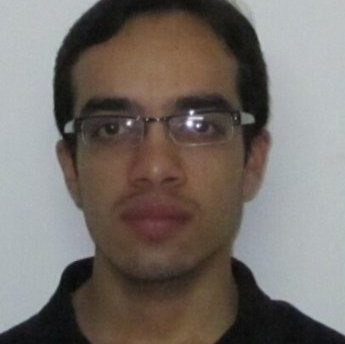

## Overview

Machine learning applications are rapidly adopted by industry leaders in any field. The growth of investment in AI-driven solutions created new challenges in managing Data Science and ML resources, people and projects as a whole. The discipline of managing applied machine learning teams, requires a healthy mix between agile product development tool-set and a long term research oriented mindset.  The abilities of investing in deep research while at the same time connecting the outcomes to significant business results create a large knowledge based on management methods and best practices in the field. The Workshop on Applied Machine Learning Management brings together applied research managers from various fields to share methodologies and case-studies on management of ML teams, products, and projects, achieving business impact with advanced AI-methods.

## Important Dates

| | |
|:--- |---:|
|  Paper submission deadline | May 28th, 2024 |
|:---|---:|
| Notification of acceptance | June 28th, 2024 |
|:---|---:|
| Workshop on Applied Machine Learning Management| August 26th 2024, 8am-12pm |

## How to attend

The workshop is a part of the ACM SIGKDD CONFERENCE ON KNOWLEDGE DISCOVERY AND DATA MINING that will happen in Barcelona, August 26th, 2024, more information can be found on the official site of the conference: https://kdd.org/kdd2024/. In order to attend the workshop you need to register to the main conference. Registration will open soon. You don't need to submit a paper if you want to attend. The conference will be in person.

## 2023 Program

| | |
|:--- |:---|
| `8.00-8.15`   (15 mins)| Opening Remarks |
|:--- |:---|
| `8.15-8.45`   (30 mins) | Invited talk |
|:--- |:---|
| `8.45-9.15`  (30 mins) | Invited talk |
|:--- |:---|
| `9.15-9.30`  (15 mins) | Contributed talk |
|:--- |:---|
| `9.30-10.00`  (30 mins) | Coffee Break and registration for round tables |
|:--- |:---|
| `10.00-10.15`  (15 mins) | Contributed talk |
|:--- |:---|
| `10.15 - 10.30`   (15 mins) | Contributed talk |
|:--- |:---|
|`10.30-11.15`  (45 mins) | Round-table discussions |
|:--- |:---|
| `11.15-11.30`   (15 mins) | Contributed talk |
|:--- |:---|
| `11.30-11.45`   (15 mins) | Contributed talk |
|:--- |:---|
| `11.45-11.50`   (5 mins) | Closing Remarks |

## Invited speakers

#### TBD

## Round-table discussions

- 5-6 contribures round table discussions

# Organizers

| | |
|:--- |:---|
| | **Dmitri (Dima) Goldenberg**  is a Senior Machine Learning Manager at Booking.com, Tel Aviv, where he leads machine learning efforts in recommendations, pricing and promotions personalization, utilizing online learning and uplift modeling techniques. Goldenberg obtained his Masters in Industrial Engineering and Management (with honors) from Tel Aviv University. He led the WSDM '21 and WWW '21 tutorials on personalization and causal uplift modeling, and co-organized the WSDM '21 WebTour, KDD'22 WAMLM and Recsys'22 RecTour workshops. His research and applied work was presented and published in top journals and conferences including WWW, CIKM, WSDM, SIGIR, KDD and RecSys. |
| | |
|  | **Elena Sokolova** is a Science Manager in applied machine learning in Amazon Research, Cambridge UK. Elena did her PhD in Nijmegen University in the Netherlands, where she worked on Recommender systems and Causality. She is now leading several projects and  teams in Alexa AI in NLP and TTS. Under her lead her team published papers in various conferences such as EMNLP, ICASSP, Interspeech, and filed several patents. Elena was nominated for European Women in Tech lead in Data award in 2019.|
| | |
|  | **Shir Meir Lador** is a Data Science group manager at Intuit, a global leader in the industry of financial management software. Shir is the co-founder of PyData Tel Aviv meetups, WiDS Tel Aviv ambassador, the co-host of “Unsupervised” (a podcast discussing data science in Israel), and gives talks at various machine learning and data science conferences and meetups. Shir holds an M.Sc. in electrical engineering and computers with a major in machine learning and signal processing from Ben-Gurion University.|
| | |
|   | **Irina Vasilinetc** is a Senior Manager in Meta. Irina supports WhatsApp Integrity team in London UK. Irina has several publications in statistics and bioinformatics. |
| | |
|   |**Lin Lee Cheong** is an Applied Science Manager with Machine Learning Solutions Lab (MLSL) in AWS at Santa Clara, CA. Lin Lee received her PhD in Electrical Engineering from the Massachusetts Institute of Technology at Cambridge, MA. She leads a team of scientists and engineers and collaborate directly with AWS strategic customers to develop practical and innovative machine learning solutions. Under her lead, the team has presented and published papers in various conferences such as KDD, NeurIPS and ICCV and filed multiple patents. Previously, she focused on applying machine learning and statistical methods to the semiconductor industry.  |
| | |
|   | **Mohak Sukhwani** is a Staff Data Scientist and Manager at Myntra, Bangalore India. He leads a team of scientists focusing on AI/ML solutions for Supply Chain Management, Pricing and various other business domains. Mohak obtained his masters in Computer Science from IIIT Hyderabad, focusing on Computer Vision and Robotics. His research work is published in major venues, including  KDD, ICRA, ECCV, ICPR and BMVC.  |
| | |
|   | **Saloni Potdar** is a Senior AI/ML Manager in Apple’s Siri and Information Intelligence team. She leads the development of natural language processing and machine learning techniques that power interactions across Siri and Spotlight Search. She works on LLMs, knowledge graphs, question answering, entity linking and synthetic data generation, and deploying these algorithms at scale. Prior to this, she was a Senior Technical Staff Member and Senior Manager at IBM Watson where she developed algorithms for IBM's conversational AI product - Watson Assistant. She has won several awards and was also a semi-finalist on MIT’s TR 35 under 35 in 2022. She was recognized as a Master Inventor at IBM for filing over 30 patents and pushing the boundaries of patent excellence. She has published over 15 research papers at top conferences like AAAI, NAACL, EMNLP and ACL. She got her Masters degree from Language Technologies Institute at Carnegie Mellon University in 2014.

