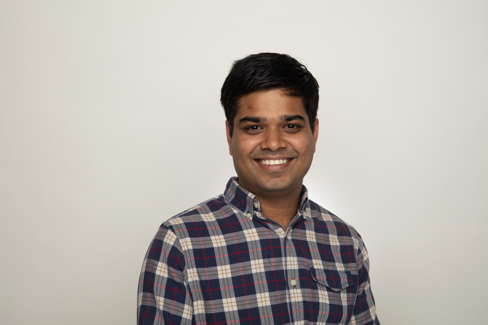

| | |
|:--- |:---|
| | **Dmitri (Dima) Goldenberg** is a Machine Learning Manager at Booking.com. He leads machine learning efforts in recommendations and promotions personalization, across teams in Tel Aviv and Amsterdam. Goldenberg obtained his Masters in Industrial Engineering and Management (with honors) from Tel Aviv University. He presented the WSDM '21 and WWW '21 on personalization and causal uplift modeling, and co-hosted the WSDM '21 WebTour workshop. His research and applied work was presented and published in top journals and conferences including WWW, WSDM, SIGIR, KDD, RecSys and ASONAM. |
| | |
|  | **Elena Sokolova** is a Science Manager in applied machine learning in Amazon Research, Cambridge UK. Elena did her PhD in Nijmegen University in the Netherlands, where she worked on Recommender systems and Causality. She is now leading several projects as a science manager of a research team in Alexa AI in NLP and TTS. Under her lead her team published papers in various conferences such as EMNLP, ICASSP, Interspeech, and filed several patents. Elena was nominated for European Women in Tech lead in Data award in 2019.|
| | |
|  | **Shir Meir Lador** is a Data Science group manager at Intuit, a global leader in the industry of financial management software. Additionally, Shir is the co-founder of PyData Tel Aviv, WiDS Tel Aviv ambassador, the co-host of “Unsupervised” (a podcast discussing data science in Israel), and gives talks at various machine learning and data science conferences and meetups. Shir holds an M.Sc. in electrical engineering and computers with a major in machine learning and signal processing from Ben-Gurion University.|
| | |
|  |**Amit Mandelbaum** is a Director of Data Science at Nvidia Networking Business Unit (formerly Mellanox) where he is leading a cross-organizatiol group in charge of all AI activities inside the business unit. Prior to that Amit was the leading data scientist at Imubit, leading all AI activities in the company and leading its product from idea to 10M$ ARR in revenues. Amit is also the founder and co-leader of JerusML, Jerusalem’s AI and largest tech community. Amit published papers in several conferences, including AAAI, GECCO, IntelliSys, ISPA and more. Amit holds an M.Sc. (with honors) in Computer Science from the Hebrew University. |
| | |
|   | **Irina Vasilinetc** is a Senior Manager in Meta. Irina supports WhatsApp Integrity team in London UK. Irina has several publications in statistics and bioinformatics. |

| | |
|   | **Ankit Jain** is a  Research Science Manager in Meta. He leads a team of ML scientists/engineers to detect harmful actors on Meta platforms using advanced deep learning techniques. Previously, he was a ML researcher at Uber AI where he worked on application of deep learning methods to different problems ranging from food delivery, fraud detection to self-driving cars. He was named as one of top 40under40 Data Scientists 2022 by Analytics India Magazine. He has co-authored a best selling book on machine learning titled TensorFlow Machine Learning Projects. Additionally, he’s been a featured speaker in many of the top AI conferences and universities and has published papers in several top conferences like Neurips, ICLR. |

